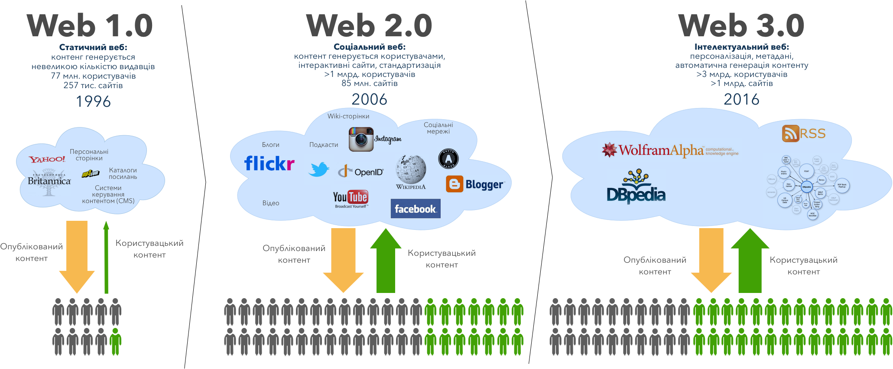
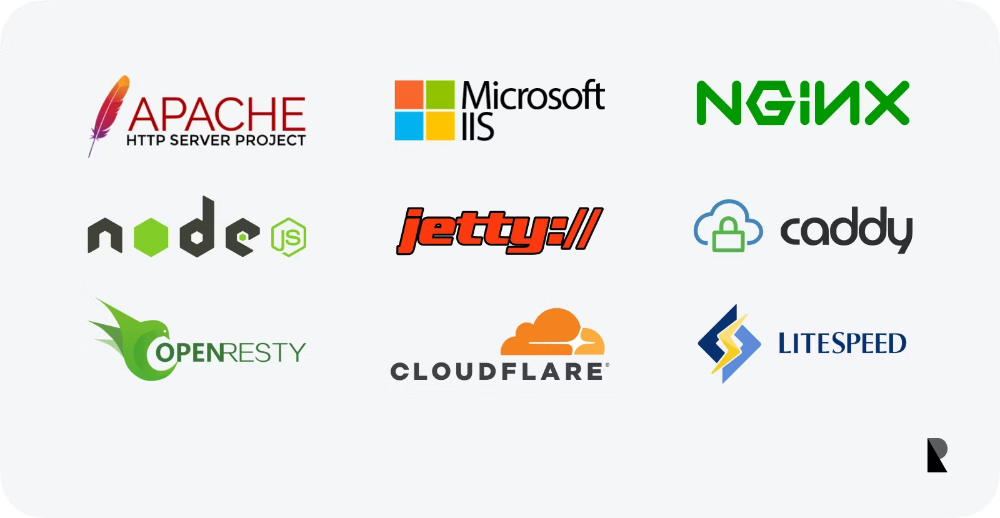
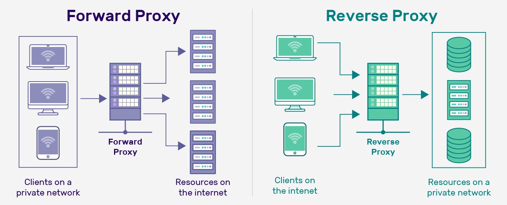
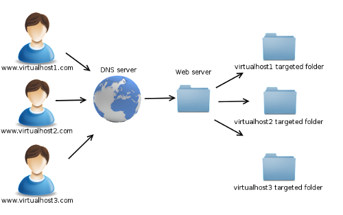
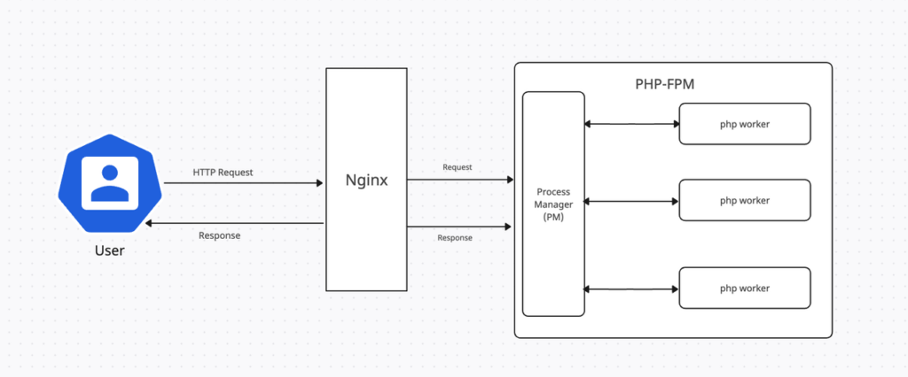
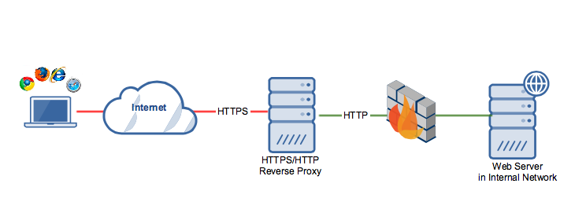

<style>
img[alt~="center"] {
  display: block;
  margin: 0 auto;
}
*{
    font-size: 0.9em;
}
small {
    font-size: 0.8em;
}
</style>

Основи роботи Web
=====

---

> Винахідником Всесвітньої павутини вважається (спільно з Робертом Кайо) британський вчений-фізик — Сер Тімоті Джон Бернерс-Лі, автор URI, HTTP і HTML. Є чинним головою Консорціуму Всесвітньої павутини (W3C). 16
> липня 2004 Королева Великобританії Єлизавета II надала йому титул Лицаря-Командора за «службу на благо глобального розвитку Інтернету».

Розглянемо, що відбувається між введенням адреси в браузері та власне отриманням на екрані сторінки. Але для початку визначимось з термінами:

---

Браузер, веб-оглядач (web-browser) — клієнтський додаток для доступу до веб-серверів по протоколу *HTTP* і перегляду веб-сторінок. Як правило браузери додатково підтримують і ряд інших протоколів (наприклад *ftp*, *file*, *mms*, *pop3*).

Веб-сервер — це мережевий додаток, обслуговуючий HTTP-запити від клієнтів, зазвичай веб-браузерів. Веб-сервер приймає і повертає відповіді, зазвичай разом з HTML-сторінкою, зображеннями, файлами або іншими даними. 

---
## Еволюція архітектури веб

Для того, щоб краще зрозуміти чому засобів тільки *HTML* та *CSS* не достатньо для розробки сучасних веб-додатків й необхідно використовувати програмування, звернемось до основних етапів розвитку архітектури веб.



---

Цей поділ не є формальним чи чітким — іноді важко однозначно сказати до якої архітектури відноситься той чи інший сайт й зазвичай їм приписують багато вторинних властивостей, однак базується він на досить простому критерії: яким чином формується контент сайту.

---

На початковому етапі розвитку веб (Веб 1.0) сайти переважно були статичними *HTML*-сторінками, які наповнювались адміністраторами. Браузери були досить прості — все, що від них вимагалось: просто відобразити сторінку, однак при цьому були значні проблеми з сумісністю між браузерами — фактично велась війна за користувача між браузерами Netscape та Internet Explorer в якій стандарти здебільшого ігнорувались. Замість пошуковиків більш поширеними були каталоги посилань. Прикладами сайтів для цього етапу вважаються персональні та корпоративні сайти, в тому числі реалізовані за допомогою CMS (система керування контентом), каталоги сайтів та об’яв як *Yahoo!*, онлайн-енциклопедія «Британіка», яка наповнювалась адміністраторами.

---

Наступний етап розвитку веб пов’язують з розповсюдженням соціальних мереж, блогів, wiki-сайтів та відеохостингів. Акцент змістився до отримання інформації безпосередньо від користувачів сайтів та їх соціальної взаємодії між собою. Звичайного *HTML* стало не вистачати для роботи, що призвело до розвитку багатьох серверних технологій, які дозволяють генерувати *HTML*-сторінки. До цього етапу також відносять значне покращення взаємодії користувача з сайтами за рахунок використання *Javascript* в парі з технологією *AJAX*, що дозволило наблизити зручність користування сайтами майже до звичайних додатків. З’являються приклади взаємодії різних сайтів для надання якісно нових послуг: так, наприклад, протокол OAuth дозволяє одним сайтам використовувати дані користувача з інших сайтів. 

---

Третій етап розвитку архітектури веб підкреслює інтелектуалізацію веб-додатків: відбувається персоналізація сторінок — користувачу надається контент, який йому найбільш цікавий, з’являється дедалі більше рекомендаційних систем та таких, що використовують машинне навчання, контент може генеруватись не тільки людиною, а й машиною на основі існуючих знань. Цей етап іноді називають семантичним вебом, ідея якого в розробці єдиного формату сторінок та метаданих до них, який був би зрозумілим не тільки для людини, а й для машини. Нажаль такого єдиного формату не розроблено й досі — існує багато розрізнених розробок, які намагались тим чи іншим чином впорядкувати існуючі знання в форматі зручному для машини й з огляду на велику кількість фундаментальних проблем з ним, навряд чи він з’явиться найближчим часом. Однак, не зважаючи на це, з’являється достатньо інтелектуальних додатків, які використовують дані про користувача з багатьох джерел, для того, щоб зробити висновки про його вподобання чи спрогнозувати його поведінку.

---

# Основні кроки отримання веб-сторінки браузером

1. Після того як користувач вводить URL, наприклад http://www.apple.com, в адресну стрічку браузера, перше що робить браузер це запитує у операційної системи IP адресу сервера з доменним ім’ям www.apple.com. Операційна система шукає відповідність доменного імені IP адресі спочатку в кеші, потім, якщо там не знайдено в файлі `/etc/hosts` для unix-like систем та `%SystemRoot%\system32\drivers\etc\hosts` для Windows. 

---

2. Далі браузер становлює TCP з’єднання на порт 80 для http (або 443 для https).
3. Браузер відсилає http пакет з GET запитом сторінки "/". Сервер повертає http статус 200 OK й вміст сторінки, зазвичай він налаштований на запит кореневої сторінки повертати файл `index.htm|html|php`.
4. Браузер по мірі отримання даних знаходить посилання на інші документи, скрипти, стилі, зображення та інші дані й посилає аналогічні запити для їх завантаження.

---

Однією з найважливіших функцій Web-сервера є надання доступу до частини локальної файлової системи. Для цього у налаштуваннях сервера вказується деяка директорія, яка є кореневою для даного сервера. Щоб опублікувати документ, тобто зробити його доступним користувачам, потрібно скопіювати цей документ у кореневу директорію Web-сервера або в одну з її піддиректорій. 

---

# Структура пакету HTTP

*HTTP* — протокол прикладного рівня для передачі гіпертекстових документів. Протокол працює за схемою запит-відповідь, не зберігаючи стану між запитами. Кожен запит/відповідь складається з трьох частин:

1. стартовий рядок;
2. заголовки;
3. тіло повідомлення, що містить дані запиту, запитаний ресурс або опис проблеми, якщо запит не виконано.

---

Запит та відповідь відрізняєються стартовим рядком. Для запиту стартовий рядок має вигляд:

    ‹Метод› ‹URI› HTTP/1.1

Основних методів - 4: `GET`, `POST`, `PUT`, `DELETE`. Однак існують ще методи, які рідше застосовуватимуться безпосередньо це `OPTION`, `HEAD`, `TRACE`. 

URI - це частина URL в браузері після доменого імені, наприклад `/users/15`.

---

Відповідь має стартовий рядок виду:

    HTTP/1.1 ‹Код› ‹Опис статусу› 
   
Код
: один з можливих кодів http, наприклад 200 - ОК, 404 - сторінку не знайдено, 500 - помилка на сервері та інші. Перша цифра коду стану визначає клас відповіді. Всього є 5 класів кодів відповідей:

    **1xx** - Інформаційні коди - запит отримано, триває обробка.  
    **2xx** - Успішні коди - дія була успішно отримано, зрозуміле і оброблено.  
    **3xx** - Коди перенаправлення - для виконання запиту повинні бути зроблені подальші дії.  
    **4xx** - Коди помилок клієнта - запит має помилку синтаксису або не може бути виконаний.  
    **5xx** - Коди помилок сервера - сервер не в змозі виконати допустимий запит.  

---

Опис статусу
: стандартне тестове пояснення до коду. Наприклад для коду 404 опис буде "Not Found". 

За рядком стану слідують заголовки (загальні, відповіді і об'єкта) і, можливо, тіло повідомлення.

---

Приклад запиту:

    GET / HTTP/1.1
    Accept:text/html;*/*;
    Accept-Language:en-US,en;
    Connection:keep-alive
    If-Modified-Since:Thu, 31 Jan 2013 23:59:04 GMT
    Host:www.apple.com
    User-Agent:Mozilla/5.0 (X11; Linux x86_64) AppleWebKit/537.36 (KHTML, like Gecko) Chrome/29.0.1547.65 Safari/537.36

---

Приклад відповіді:

    HTTP/1.1 200 OK
    Connection:keep-alive
    Content-Encoding:gzip
    Content-Length:20
    Content-Type:text/html; charset=UTF-8
    Date:Wed, 11 Sep 2013 18:19:14 GMT
    Expires:Wed, 11 Sep 2013 18:20:45 GMT
    Server:Apache
    
    <html>Content</html>

Починаючи з `HTTP/1.1` обов'язковим став тільки заголовок `Host` - щоб розрізнити кілька доменів, які мають одну і ту же IP-адресу (так званий віртуальний хостинг).

---

# Адресація веб-ресурсів. URL, URN, URI

Для доступу до будь мережевих ресурсів необхідно знати де вони розміщені і як до них можна звернутися. У Всесвітній павутині для звернення до веб-документів використовується стандартизована схема адресації та ідентифікації, що враховує досвід адресації та ідентифікації таких мережевих сервісів, як e-mail, telnet, ftp і т.п. - URL, Uniform Resource Locator.

---

URL (RFC 1738) - уніфікований локатор (покажчик) ресурсів, стандартизований спосіб запису адреси ресурсу в www і мережі Інтернет. Адреса URL має гнучку і розширювану структуру для максимально природного зазначення місцезнаходження ресурсів в мережі. Для запису адреси використовується обмежений набір символів ASCII. Загальний вигляд адреси можна представити так:

    <схема>://<логін>:<пароль>@<хост>:<порт>/<повний-шлях-до-ресурсу>?<параметр>=<значення>&<параметр>=<значення>

---
 
`<схема>://<логін>:<пароль>@<хост>:<порт>/<повний-шлях-до-ресурсу>?<параметр>=<значення>&<параметр>=<значення>`

де:

схема
: схема звернення до ресурсу: http, ftp, gopher, mailto, news, telnet, file, man, info, whatis, ldap, wais і т.п.

логін:пароль
: якщо ресурс потребує авторизаційних даних, то ім'я користувача та його пароль для доступу вказується перед іменем хоста через двокрапку, а після них ставиться `@`. 

---
`<схема>://<логін>:<пароль>@<хост>:<порт>/<повний-шлях-до-ресурсу>?<параметр>=<значення>&<параметр>=<значення>`

хост
: доменне ім'я хоста, наприклад `google.com` або його IP-адреса

порт
: порт хоста для підключення, якщо не вказано, то зазвичай використовується стандартний порт для даного протоколу (`http` – 80, `https` – 443, `ftp` – 21 і так далі)


---

`<схема>://<логін>:<пароль>@<хост>:<порт>/<повний-шлях-до-ресурсу>?<параметр>=<значення>&<параметр>=<значення>`

шлях до ресурсу
: відповідно назві — шлях до ресурсу в межах сервера, це може бути відносний шлях до файлу на диску або віртуальний шлях, на основі якого сервер згенерує контент. В якості розділювачів шляху використовується стандарт unix систем — `/`.

параметри
: опціонально, якщо ми доступаємось до скрипта можна вказати йому набір іменованих параметрів. Такі параметри надаються після `?`, ім’я параметра та його значення розділяються `=`, а самі параметри — `&`.

---

# Веб сервери

Веб-сервер — це програмне забезпечення, яке обробляє HTTP-запити від клієнтів (зазвичай веб-браузерів) і надає їм відповідні ресурси, такі як HTML-сторінки, зображення, відео та інші файли. Веб-сервери можуть також виконувати серверні скрипти для генерації динамічного контенту.

---
# Приклади

Прикладами популярних веб-серверів є Apache, Nginx, Microsoft Internet Information Services (IIS), LiteSpeed та інші.



---
# Proxy

*Проксі-сервер* (проксі) — це сервер, який виступає посередником між клієнтом і іншим сервером. 



---

# Forward proxy або просто проксі-сервер

Приймає запити від клієнтів, пересилає їх на інший сервер і повертає відповідь клієнту. Зазвичай використовуватися для кешування, фільтрації контенту, анонімізації трафіку.

Виступає зі сторони клієнта, тобто клієнт знає про його існування і використовує його для доступу до інших ресурсів.

---
# Reverse proxy

*Зворотний проксі-сервер* (reverse proxy) — це тип проксі-сервера, який приймає запити від клієнтів і пересилає їх на один або кілька серверів. Він виступає як посередник між клієнтами та серверами, але на відміну від звичайного проксі-сервера, який працює на стороні клієнта, зворотний проксі працює на стороні сервера. 

Часто використовуються для балансування навантаження, кешування, SSL-термінації та забезпечення безпеки. Виступають зі сторони сервера, тобто клієнт не знає про його існування і вважає, що звертається безпосередньо до сервера.

---

# OpenResty / NGINX

*OpenResty* / NGINX — це високопродуктивний веб-сервер, який також може використовуватися як зворотний проксі-сервер, балансувальник навантаження та HTTP-кеш. Він відомий своєю здатністю обробляти велику кількість одночасних з'єднань та низьким використанням пам'яті.

```bash
docker run -v /Users/sergeykhruschak/workspace/Univer/web/site:/usr/share/nginx/html:ro -p 80:80 nginx
```
--- 

# Приклад конфігурації NGINX

```nginx
server {
    listen 80;
    server_name localhost;

    root /var/www/html;

    location / {
        try_files $uri $uri/ =404;
    }
}
```

---
# Віртуальний хостинг



Віртуальний хостинг — це метод, який дозволяє одному веб-серверу обслуговувати кілька доменів або веб-сайтів.


---
# Приклад конфігурації з SSL та віртуальним хостингом

```nginx
server {
    listen 80;
    listen 443 ssl;
    server_name example.com www.example.com;

    ssl_certificate /etc/ssl/certs/example.com.crt;
    ssl_certificate_key /etc/ssl/private/example.com.key;

    location / {
        try_files $uri $uri/ =404;
    }
}
```

---

# Динамічний контент

Поки що ми працювали зі статичним контентом, тобто файлами, які зберігаються на диску сервера та віддаються клієнту без змін. Однак, часто потрібно генерувати контент динамічно, наприклад, на основі даних з бази даних або інших джерел. Для цього використовуються різні технології та мови програмування. 

Розглянемо кілька основних підходів до генерації динамічного контенту.

---

# CGI
CGI (Common Gateway Interface) — це дещо застарілий стандарт, який дозволяє веб-серверам взаємодіяти з зовнішніми програмами для генерації динамічного контенту. CGI-програми можуть бути написані на будь-якій мові програмування.


---

# CGI

По факту CGI вказує веб серверу просто запустити зовнішню програму, яка обробляє запит і повертає відповідь. 

Наприклад, якщо веб-сервер отримує запит на `/cgi-bin/script.exe`, він запускає програму `script.exe`, передає можливі параметри та заголовки як змінні середовища. Програма яка обробляє запит і повертає відповідь у звичайний вивідний потік (stdout).

Однак це може бути повільно та неефективно, оскільки кожен запит створює новий процес.

---

# FastCGI

FastCGI — це вдосконалена версія CGI, яка дозволяє зберігати процеси в пам'яті між запитами, що значно підвищує продуктивність. FastCGI працює як TCP-сервер, який приймає запити від веб-сервера та обробляє їх асинхронно.



---

# FastCGI

Ідея FastCGI в тому що веб-сервер бере на себе всю обробку HTTP-запитів, HTTPS а також роботу зі статичним контентом, а FastCGI-сервери обробляють запити на рівні бізнес-логіки, що простіше ніж працювати з HTTP напряму. 

Однак по факту FastCGI зараз залишився тільки в PHP, де він використовується для роботи з PHP-FPM (FastCGI Process Manager). 

Існує також новіші версії WSGI/ASGI (Python). Однак більшість фреймворків використовують власні рішення, які одразу обробляють HTTP.

---

# Обробка запитів вбудованими засобами

Більшість сучасних веб-фреймворків, мають вбудовані засоби для обробки HTTP-запитів. Вони надають абстракції для роботи з запитами та відповідями, що дозволяє розробникам зосередитися на бізнес-логіці, а не на низькорівневих деталях.

Це значно спрощує розробку, конфігурацію та масштабування веб-додатків (особливо в мікросервісній архітектурі).

---

# Приклад обробки запитів на Node.js з використанням Express

```javascript
const express = require("express");
const app = express();

app.get("/", (req, res) => {
  res.send("<h1>Hello</h1>");
});

app.listen(3000, () => {
  console.log("Server running at http://localhost:3000/");
});
```

---

# Використання Reverse Proxy сервера

<small>
Однак всеодно програми рідко виставляють в інтернет напряму, а ховають за зворотнім проксі-сервером, який приймає HTTPs запити від клієнтів і пересилає їх на один або кілька серверів вже як HTTP. Балансуючи навантаження, кешуючи відповіді та забезпечуючи безпеку.
</small>



---

# NGINX як Reverse Proxy

```nginx
server {
    listen 80;
    listen 443 ssl;
    server_name example.com www.example.com;

    ssl_certificate /etc/ssl/certs/example.com.crt;
    ssl_certificate_key /etc/ssl/private/example.com.key;

    location /kiosk/ {
        proxy_pass http://10.1.2.3:3000;
    }
}
```