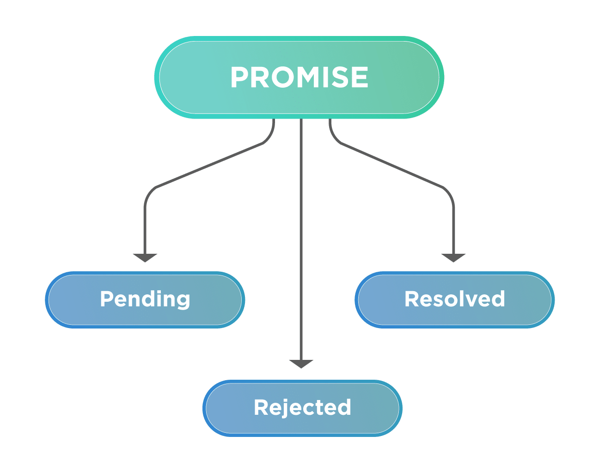

<style>
img[alt~="center"] {
  display: block;
  margin: 0 auto;
}
*{
    font-size: 0.8em;
}

em { 
	font-size: 0.9em; 
}

small {
    font-size: 0.7em;
}
</style>

Javascript
=====

---

**JavaScript** (ECMA Script) — мова написання сценаріїв для веб-сторінок та вбудованих сценаріїв, що базується деяких функціональних концепціях та принципах прототипного наслідування.

*JavaScript* було створено на хвилі популярності мови *Java*, тому компанія *Netscape*, яка власне створювала дану мову, отримала дозвіл від *Sun* додати в назву слово *Java*, але крім назви дані дві мови мають дуже мало спільного - це мови різного призначення, різних можливостей та підходів до створення програм. 

*JavaScript* спочатку створювався як мова для браузерів, однак з часом вона стала використовуватися в багатьох інших сферах, наприклад, в серверних додатках, мобільних додатках, іграх та інше.

---

Початкове застосування *Javascript* в основному було для часткової автоматизації обробки та завантаження даних сторінки, наприклад, перевірка даних, що вводить користувач на льоту, обрахунки, а пізніше умовне завантаження частин сторінки та інше. 

Однак з часом все більше й більше компаній почали впроваджувати RIA (Rich Internet Applications) - веб додатки, що по функціоналу, можливостям та швидкості роботи максимально наближені до звичайних додатків й досягається це в тому числі засобами *Javascript*, тому тенденція така, що доля функціоналу реалізованого на *Javascript* в додатках зростає.

Також *Javascript* використовується в багатьох інших сферах, наприклад, в NodeJs, Deno, Bun - серверній платформі, що дозволяє створювати серверні додатки. Electron - фреймворк для створення кросплатформних настільних додатків, React Native - фреймворк для створення мобільних додатків, а також в багатьох інших сферах.

---

*Javascript* відрізняється від традиційних об’єктно орієнтованих мов — він не підтримує основні принципи ООП, але при цьому має деякі властивості об’єктно-орієнтованої мови: в ньому є об’єкти, прототипне наслідування та поліморфізм. 

Також підтримуються деякі властивості функціональних мов програмування: функції як об’єкти першого рівня, об’єкти як списки, currying, анонімні функції, замикання (closures).

JavaScript має *C*-подібний синтаксис, який дещо схожий на спрощений синтаксис мови *Java*. Семантика мови схожа з семантикою *Self*.

---

Вбудовування в *HTML*
----------

Текст javascript програми включається безпосередньо в *HTML*-документ і виконується вбудованим в браузер *Javascript* двигуном (engine). Абсолютна більшість сучасних браузерів підтримують *Javascript*. 

##### Використовуючи теги `<script>`

Код *JavaScript* вставляється в теги `<script></script>` з обов’язковим атрибутом `type="text/javascript"`. Традиційний Hello, World! можна описати наступним чином:

```html
<script type="text/javascript">
  alert('Hello, World!');
</script>
```

В данному випадку показується діалогове вікно з повідомленням. Код *Javascript* виконується браузером одразу по мірі його зустрічання на сторінці.

---

##### Підключення зовнішніх файлів

Другим варіантом підключення *Javascript*, по аналогії з *CSS* — використання окремих файлів, та підключення їх до сторінки:

```html
<script type="text/javascript" src="/js/registration.js"></script>
```

---

##### Вбудовування в *HTML* через атрибути

Ну й знову ж таки по аналогії з *CSS* - можливо включати *Javascript* безпосередньо в атрибути тегів. Наприклад наступний код покаже діалогове вікно при натисканні на посилання та перейде на нього тільки якщо користувач натиснув так:
 
```html
<a href="http://anothersite.com" onclick="return confirm('Ви дісно хочете перейти на інший сайт?');">Посилання</a>
```

Працює це наступним чином - функція `confirm()` покаже діалогове вікно з написом та в залежності від того, що натиснув користувач поверне `true` або `false`. А конструкція `return false;` в обробнику `onclick` тега заблокує перехід за посиланням. 

---

## Підхід прогресивного збагачення документу

Код *Javascript* при цьому буде працювати тільки, якщо він підтримується й увімкнений в браузері, в останньому випадку — нічого страшного не відбудеться якщо *Javascript* буде вимкнено — просто перехід за посиланням відбуватиметься без підтвердження. 

Тобто *Javascript* допомагає користувачу, однак без нього сайт теж працюватиме нормально — такий підхід був популярний кілька років тому, однак зараз відходить на другий план — все більше й більше додатків не зможуть як слід працювати без підтримки *Javascript*. 

Такий підхід називається *прогресивне збагачення* (progressive enhancement) — спочатку створюється базовий функціонал, який працює без *Javascript*, а потім додається додатковий функціонал, який працює тільки при підтримці *Javascript*.

---

Для того, щоб відобразити користувачу повідомлення, якщо у нього вимкнено або відключено javascript (як і будь-які клієнтські скрипти) існує спеціальний тег `<noscript>`:

```html
<body>
  <noscript>Вибачте, але у вас не підтримується javascript, який так необхідний для нашого сайту</noscript>
</body>
```

---

Типи даних
---------

В *Javascript* є всього 6 основних типів даних:

boolean: булеві значення - `true` або `false`

```javascript
let flag = false;
```

number: числа як цілі так і дробові

```javascript
const num = 5.0;
```

Як видно перед визначенням змінної не вказується тип, оскільки *Javascript* є динамічно типізованою мовою, тобто тип змінної визначається автоматично при присвоєнні значення. Однак необхідно вказати одне з ключових слів `let` (змінна, або старіший варіант `var`) або `const` – константа.

---

string: стрічки. Визначається в подвійних або в одинарних лапках (рівнозначно):

```javascript
let str = "Деяка стрічка";
let strWithHtml = '<a href="http://apple.com">До яблук</a>';
```

Також в *Javascript* підтримуються шаблонні стрічки, які обмежуються зворотними лапками (backticks). Вони дозволяють вставляти змінні та вирази в стрічку за допомогою `${}`:

```javascript
let strWithBackticks = `Це стрічка з ${num} числом`;
let backticksWithHtml = ```
Багаторядкова стрічка
```;
```

Крапка з комою в кінці рядка не є обов’язковою, однак рекомендується її використовувати.

---

array: массиви даних
```javascript
let arr = [];
let arr2 = [1, 2, 3, "текст", true];
```

object: об’екти

```javascript
let obj = {};
obj.name = "Дмитро";
obj.age = 30;
obj["city"] = "Київ";

let obj2 = {
  name: "Кіндрат",
  age: 30,
  city: "Київ"
};
```

---

function: функції

```javascript
function add(a, b) {
  return a + b;
}

let sum = add;

let pow = function(x, n) {
  return x ** n;
}

let pow2 = (x, n) => x ** n; // стрілочна функція
```

*Javascript* є динамічно типізованою мовою, тому тип аргументів визначається автоматично при виклику функції, тому фукнція `add` може приймати як числа, так і стрічки, в залежності від того, що передали в неї при виклику.

---

Функції можуть повертати значення, при цьому якщо функція не повертає значення, то вона повертає `undefined`. 

```javascript
function greet(name) {
  if (name) {
    return `Привіт, ${name}!`;
  }
}
```

Також можна створювати функції всередині інших функцій, такі функції називаються *вкладеними* (nested) або *внутрішніми* (inner) функціями:

```javascript
function buildHandler() {
  return function handler() {
    console.log("Це внутрішня функція");
  }	
}

build()(); // викликаємо зовнішню функцію, яка повертає внутрішню
```

---

# Аргументи функцій

Javascript функції можуть приймати необмежену кількість аргументів, при цьому якщо аргументів передали менше ніж вказано в сигнатурі функції, то відсутні аргументи будуть мати значення `undefined`. Якщо ж аргументів передали більше, то вони будуть проігноровані.

```javascript
function add(a, b) {
  return a + b;
}

console.log(add(1, 2, 3));
console.log(add(1));
```

---

# Typescript

Існує окрема мова *Typescript*, яка є надбудовою над *Javascript* та дозволяє використовувати статичну типізацію, тобто вказувати типи змінних, аргументів функцій та повертаємого значення функцій. Це дозволяє зменшити кількість помилок в коді та зробити його більш читабельним.

```typescript
let x: number = 10
const y: string = "Hello"

function add(a: number, b: number): number {
  return a + b;
}

```

---

Особливо це корисно в великих проектах з багатьма розробниками та просто при розробці складних додатків, де важливо мати чітке розуміння типів даних, які використовуються в коді. В javascript не зрозуміло які поля є у користувача:

```javascript
let user = fetchUserData('/user');
```

У випадку з *Typescript* можна вказати тип даних, який повертає функція `fetchUserData`, що дозволяє отримати переваги статичної типізації:

```typescript
let user: {
  name: string;
  age: number;
};

let user: User = fetchUserData('/user');
```

Однак *Typescript* не підтримується в браузерах, тому для його використання доведеться всі файли перетворити в javascript спеціальною програмою – транспіллером.

---
# Слабка типізація
*Javascript* є слабко типізованою мовою, тобто змінні можуть змінювати свій тип в процесі виконання програми. Наприклад, змінна може спочатку бути числом, а потім стати стрічкою:

```javascript
console.log("5" + 3);   // "53" (конкатенація)
console.log("5" - 3);   // 2 (рядок "5" перетворився в число)
console.log(1 == "1");  // true  (автоматичне приведення)
console.log(1 === "1"); // false (строге порівняння потрійне =)
```

Дякуючи цьому в мову введено два оператори порівняння == та === (й відповідно зворотніх != та !==), оператор з приведенням типів та без приведення. Розглянемо коли таке може бути корисним:

---

# Ще приклади порівняння

```javascript
'' == '0'           // false
0 == ''             // true
0 == '0'            // true

true == 1.          // true
false == 'false'    // false
false == '0'        // true
false == undefined  // false
false == null       // false
null == undefined   // true

' \t\r\n ' == 0     // true
```

---

Однак для `===`:

```javascript
'' === '0'          // false
0 === ''            // false
0 === '0'           // false

false === '0'        // true
null === undefined   // false
' \t\r\n ' === 0.    // false
```

> Оператори `==` та `!=` часто називають evil twins, оскільки вони досить часто призводять до неочікуваних результатів, тому як загальна рекомендація - в більшості випадків використовувати оператори `===` та `!==`

---

В javascript визначено деякі стандартні значення:

`NaN`: значення, що зазвичай отримується в результаті арифметичних операцій та означає що результатом є не число. Наприклад, метод `parseInt` що перетворює стрічку в число у випадку якщо стрічка не є числом повертає `NaN`. Це значення в Javascript не дорівнює нічому, тому перевіряти на `NaN` необхідно через спеціальну функцію `isNaN()`: 

```javascript
let n = parseInt("word")
alert(isNaN(n));
```

`null`: пусте значення `let n = null;`

---

`undefined`: значення, яке вказує що змінна (чи поле об’єкту) не існує. Зазвичай це значення використовується у операторах перевірки, при цьому необхідно застосовувати оператор `===`, створимо глобальну змінну тільки якщо її не існує:

```javascript
let object = {};

if(typeof(object.unknown) === 'undefined') {
  object.unknown = 1;
}
```

Infinity: безкінечність, можна отримати наприклад в результаті операції `1/0`. Буває позитивною та негативною. Краще за все перевіряти чи число дорівнює безкінечності використовуючи функцію `isFinite`, яка поверне true, якщо число не є NaN і є кінечним.

---

# Duck typing

У JS важливий не тип, а поведінка об’єкта. Якщо об’єкт має метод чи властивость, які ми очікуємо — з ним можна працювати, навіть якщо це інший "тип".

```javascript
function quack(duck) {
  duck.quack();
}

const realDuck = { quack: () => console.log("Кря!") };
const toyDuck = { quack: () => console.log("Пластикове кря!") };

quack(realDuck); // Кря!
quack(toyDuck);  // Пластикове кря!
```

---

### Класи

```javascript
class Person {
  constructor(name, age) {
    this.name = name;
    this.age = age;
  }

  greet() { console.log(`Привіт, мене звати ${this.name}`); }
}

class Student extends Person {
  constructor(name, age, course) {
    super(name, age); // викликає батьківський конструктор
    this.course = course;
  }

  study() { console.log(`${this.name} навчається на курсі ${this.course}`); }
}

const person = new Person("Марія", 22);
```

---

# Прототипне наслідування

Наслідування в *Javascript* – прототипне, що базується на обʼєктах а не на класах. У кожного обʼєкта є прототип і якщо властивість чи метод не знайдені в обʼєкті – вона шукається в прототипі.

```javascript
let animal = {
  eats: true
};

let rabbit = {
  jumps: true
};

rabbit.__proto__ = animal;

console.log(rabbit.jumps); // true (з rabbit)
console.log(rabbit.eats);  // true (з animal)
```

---
# Модель виконання потоків в JavaScript 

JavaScript виконується в однопоточному середовищі, що означає, що всі команди виконуються послідовно, одна за одною. Це дозволяє уникнути проблем з синхронізацією, але може призвести до блокування інтерфейсу користувача при виконанні довгих операцій.

Тому в Javascript більшість операцій виконуються асинхронно і не блокують основний потік виконання. Це дозволяє браузеру продовжувати реагувати на дії користувача, поки виконується асинхронна операція. 

---

Тому, якщо, наприклад, необхідно почекати 1 секунду перед виконанням наступної команди, то операції типу `delay(1000)` не існує, а замість цього використовується функція `setTimeout`, яка приймає функцію та час затримки в мілісекундах:

```javascript
setTimeout(() => console.log("Через 1 секунду"), 1000);
```

Або виконання з інтервалом:

```javascript
setInterval(() => console.log("Кожну секунду"), 1000);
```

---

# Callbacks

Якщо необхідно виконати код після завершення асинхронної операції, то можна використовувати колбеки (callback) або проміси (Promise).


```javascript
function loadData(callback) {
  setTimeout(() => {
    const data = { name: "Дмитро", age: 30 };
    callback(data);
  }, 1000);
}
```

---

# Callback-hell

Однак використання колбеків може призвести до так званого "callback-hell" - коли код стає важким для читання та підтримки через вкладеність колбеків:

```javascript
loadData((data) => {
  console.log("Дані завантажено:", data);
  processData(data, (processedData) => {
    console.log("Дані оброблено:", processedData);
    saveData(processedData, (result) => {
      console.log("Дані збережено:", result);
    });
  });
});
```

Тому в *Javascript* з'явився клас Promise, який дозволяє уникнути вкладеності колбеків та зробити код більш читабельним.

---
# Promises

Проміси (Promises) — це об'єкти, які представляють асинхронну операцію, яка може завершитися успішно або з помилкою. Це просто контейнер для значення, яке буде доступне в майбутньому, однак дозволяє проводити операції над цим значенням, коли воно стане доступним.



---

Promise дозволяють обробляти асинхронні операції більш зручно, ніж колбеки, оскільки вони дозволяють обробляти результати асинхронних операцій ланцюжком:

```javascript
loadData()
  .then((result) => {
    console.log("Дані завантажено", result);
    return processData(result);
  })
  .then((result) => {
    console.log("Дані оброблено", result);
    return saveData(result);
  }).then((result) => {
    console.log("Дані збережено", result);
    return result;
  })
  .catch((error) => {
    console.error("Помилка:", error);
  });
``` 

---

Для прикладу створення промісу розробимо асинхронну функцію затримки delay, яка повертає проміс:

```javascript

function delay(ms) {
  return new Promise((resolve, reject) => {
    setTimeout(resolve, ms);
  });
}

delay(1000).then(() => {
  console.log("Через 1 секунду");
});
```

--- 
# Async/Await

Async/Await — це синтаксичний цукор для роботи з промісами, який дозволяє писати асинхронний код у вигляді синхронного. Це робить код більш читабельним та зрозумілим.

Функція має бути оголошена з ключовим словом `async`, а всередині неї можна використовувати ключове слово `await` для очікування завершення промісу:

```javascript
async function loadData() {
  const data = await fetchData();
  console.log("Дані завантажено:", data);
  const processedData = await processData(data);
  console.log("Дані оброблено:", processedData);  
  const result = await saveData(processedData);
  console.log("Дані збережено:", result);
  return result;
}
```